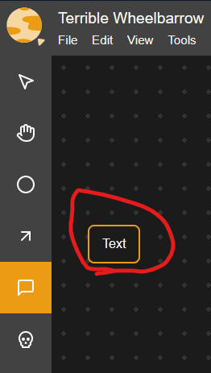
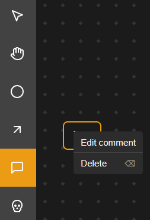
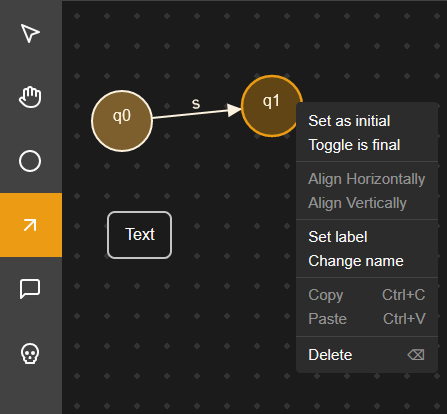
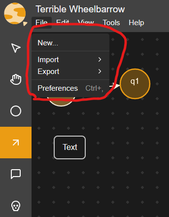
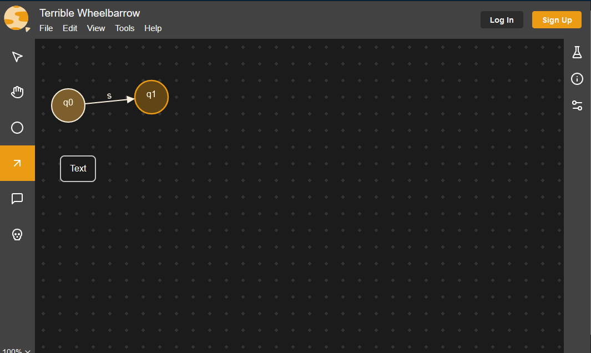
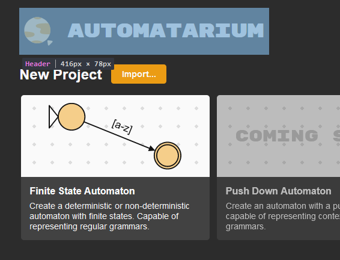

# Components

This file breaks down each component briefly and gives descriptions of its functionality. 

- [Components](#components)
- [Button](#button)
- [CommentRect](#commentrect)
- [ContextMenus](#contextmenus)
  - [Examples](#examples)
- [Details](#details)
- [Dropdown](#dropdown)
  - [Examples](#examples-1)
- [EditorPanel](#editorpanel)
  - [Examples](#examples-2)
- [Footer](#footer)
  - [Example](#example)
- [GraphContent](#graphcontent)
- [GraphView](#graphview)
  - [useViewDragging Hook](#useviewdragging-hook)
- [Header](#header)
- [InitialStateArrow](#initialstatearrow)
- [Input](#input)
- [InputDialogs](#inputdialogs)
- [Label](#label)
- [Logo](#logo)
- [Main](#main)
- [Menubar](#menubar)
- [Modal](#modal)
- [Preference](#preference)
- [ProjectCard](#projectcard)
- [SectionLabel](#sectionlabel)
- [SelectionBox](#selectionbox)
- [Sidebar](#sidebar)
- [Sidepanel](#sidepanel)
- [Spinner](#spinner)
- [StateCircle](#statecircle)
- [Switch](#switch)
- [Table](#table)
- [Toolbar](#toolbar)
- [Tracepreview](#tracepreview)
- [TraceStepBubble](#tracestepbubble)
- [TransitionSet](#transitionset)

# Button
**Returns a wrapper containing the relevant values**

A simple custom button that takes either an icon or children argument to display text/icon.

Styled using the buttonStyle.js file - src/components/Button/buttonStyle.js

# CommentRect
**Returns a foreignObject svg element with the appropriate values**

Created by the user when they use the comment tool. Draws a rectangle on the editor containing user entered text.

Dispatches a custom event called 'comment:mousedown' when the user clicks down using their primary mouse key on the comment. Similarly, dispatches a custom event 'comment:mouseup' when the user releases the primary mouse key.

Utilises the selection store (more on this in the hooks section of the code documentation) to save its selected state.
Uses view store to set its .... size / scale / position relative to the editor.

Styled using commentRectStyle.js file.

# ContextMenus
**returns a styled Dropdown component with the appropriate context**

Custom right click menus. graphContextItems.js, stateContextItems.js, commentContextItems.js and transitionContextItems.js contain a json-like array which tells ContextMenus.js what to display when a user right clicks on the appropriate component.

The 'action:' section of these files uses the custom hook useActions and its respective entry in the actions array to determine the functionality of the menu item.

For example, to add a new context menu item, add a new entry into the ___ContextItems.js file (e.g. graphContextItems.js) with an appropriate label and action. Then, in the useActions hook define the action (using the same name as you used in ____ContextItems.js).

Context Menus utilises the custom hook useEvent, and the custom component [dropdown](#dropdown) to display the appropriate dropdown menu on right click.

useEvent detects whether an event ('ctx:svg', 'ctx:state', 'ctx:transition', 'ctx:comment') has been fired, sets the context, which the dropdown component that is returned uses to display the appropriate elements.

## Examples

Context Menu for comment

Context Menu for State

# Details

Unsure what uses this component.

# Dropdown
**returns a wrapper containing information passed to the dropdown component**

To utilise this component, 

## Examples

# EditorPanel

Comprised of several different components that create the main editor panel as seen in the examples below.

For interactivity, EditorPanel uses custom hooks for selection and dragging of states, comments and transitions. View the hooks section in the documentation for more information on how these function.

These are:

    - useStateSelection
    - useTransitionSelection
    - useCommentSelection
    - useStateDragging
    - useCommentDragging
    - useTransitionCreation
    - useStateCreation

To draw the panel itself and the related components, it uses GraphContent, GraphView, SelectionBox, TransitionSet, ContextMenus and InputDialogs. For more information on these, view their respective entries in the documentation. The box drawn by the select tool is rendered using SelectionBox.

## Examples
The editor panel is highlighted in blue in the first image.

 

# Footer

Simple component to display the footer on the landing page of the application.

## Example

# GraphContent

This component grabs information from the project store about any states/transitions/comments that should be rendered on project initialization (i.e. if the user is coming from a previously created project).

It then ... calculates appropriate position and direction for the transitions.

And finally renders the states, comments, and transitions in their appropriate position. 

# GraphView

Utilises an SVG element to draw inside the browser. GraphView functions within the [EditorPanel](#editorpanel). 

- Dispatches custom mouse events which other components and hooks are able to use (svg:mousedown, svg:mouseup and svg:mousemove)
- Keeps track of browser resizing
- Responsible for managing view dragging (useViewDragging hook)

This makes heavy use of various stores, for more information see the documentation on stores.

## useViewDragging Hook

# Header

Displays the header on the main page. 

# InitialStateArrow

# Input

# InputDialogs

# Label

# Logo

# Main

# Menubar

# Modal

# Preference

# ProjectCard

# SectionLabel

# SelectionBox

# Sidebar

# Sidepanel

# Spinner

# StateCircle

# Switch

# Table

# Toolbar

# Tracepreview

# TraceStepBubble

# TransitionSet